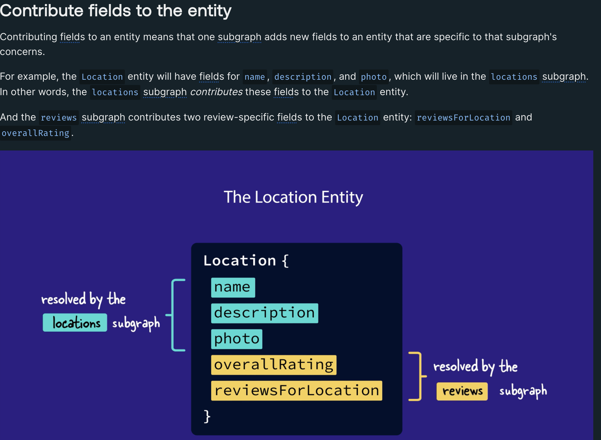

## Converting to Subgraph servers

Add the following **"Federation 2 definition"** in `locations.graphql` (An expected error may occur)

```graphql
extend schema
  @link(url: "https://specs.apollo.dev/federation/v2.5", import: ["@key"])
```

This lets us opt into the latest features of **Apollo Federation**. It also lets us import the various directives we'd like to use within our schema file (like the `@key` directive, shown above).

**To resolve the error...**

```bash
npm install @apollo/subgraph
```

`subgraph-locations/index.js`

```diff
 const { ApolloServer } = require("@apollo/server");
 const { startStandaloneServer } = require("@apollo/server/standalone");
+const { buildSubgraphSchema } = require("@apollo/subgraph");

- const server = new ApolloServer({ typeDefs, resolvers });

+ const server = new ApolloServer({
+  schema: buildSubgraphSchema({ typeDefs, resolvers }),
+ });
```

**This should now resolve the error** and in the `Apollo Sandbox`

Under the Query root type, we should see a new field, `_service`. This is one of the federation-specific fields that `buildSubgraphSchema` adds to the subgraph. The router uses this field to access the SDL string for your subgraph schema. We won't use this field directly, but seeing it appear in the Explorer tells us that our subgraph is running correctly

## Create Supergraph in Apollo Studio

> **IMPORTANT** Requires Apollo Enterprise Plan


**Supergraph Pipeline Track** must be `Federation 2.5 Supergraph (default)`

To publish subgraph, see [Publishing Subgraph](#publishing-subgraph-schemas)

```txt
APOLLO_KEY=service:my-graph-name:ABcdEFgHi0jKLM1nOP_QRS \
  rover subgraph publish my-graph-name@current \
  --schema ./products-schema.graphql \
  --name your-subgraph-name \
  --routing-url http://products.prod.svc.cluster.local:4001/graphql
```

|                    |                                              |
| ------------------ | -------------------------------------------- |
| `APOLLO_KEY`       | service:my-graph-name:ABcdEFgHi0jKLM1nOP_QRS |
| `APOLLO_GRAPH_REF` | my-graph-name@current                        |

### Apollo Studio Environment Variables

See `router/.env`

| Key                | Description                                                                         |
| ------------------ | ----------------------------------------------------------------------------------- |
| `APOLLO_KEY`       | API key for authenticating **Rover**                                                |
| `APOLLO_GRAPH_REF` | Identifies which supergraph to publish to. <br /> i.e. `<GRAPH_ID>@<GRAPH_VARIANT>` |

## Setting up Rover CLI

**Installation Methods**

- [Linux / MacOS Installation](#linux--macos-installer)
- [Windows Powershell Installation](#windows-powershell-installer)
- Others methods: https://www.apollographql.com/docs/rover/getting-started/

### Linux / MacOS Installer

```bash
curl -sSL https://rover.apollo.dev/nix/latest | sh
```

Specific Version

```bash
# Note the `v` prefixing the version number
curl -sSL https://rover.apollo.dev/nix/v0.22.0 | sh
```

### Windows Powershell Installer

```bash
iwr 'https://rover.apollo.dev/win/latest' | iex
```

Specific Version

```bash
# Note the `v` prefixing the version number
iwr 'https://rover.apollo.dev/win/v0.22.0' | iex
```

**After installation, verify via following command in terminal**

```bash
rover
```

```bash
lightzane@JPs-MacBook-Air odyssey-voyage-I % curl -sSL https://rover.apollo.dev/nix/latest | sh
downloading rover from https://github.com/apollographql/rover/releases/download/v0.22.0/rover-v0.22.0-aarch64-apple-darwin.tar.gz
writing binary to /Users/lightzane/.rover/bin/rover
rover was successfully installed. Great!

To get started you need Rover's bin directory (/Users/lightzane/.rover/bin) in your PATH environment variable. Next time you log in this will be done automatically.

To configure your current shell, you can run:
exec /bin/zsh -l
If you would like to disable Rover's anonymized usage collection, you can set APOLLO_TELEMETRY_DISABLED=1
You can check out our documentation at https://go.apollo.dev/r/docs.
lightzane@JPs-MacBook-Air odyssey-voyage-I % rover
zsh: command not found: rover
lightzane@JPs-MacBook-Air odyssey-voyage-I % exec /bin/zsh -l
lightzane@JPs-MacBook-Air odyssey-voyage-I % rover
Rover - Your Graph Companion

Usage: rover [OPTIONS] <COMMAND>

Commands:
```

### Authenticate Rover

Run command in terminal and paste your `APOLLO_KEY`

```bash
rover config auth
```

```bash
lightzane@JPs-MacBook-Air odyssey-voyage-I % rover config auth
Go to https://studio.apollographql.com/user-settings/api-keys and create a new Personal API Key.
Copy the key and paste it into the prompt below.
>
Successfully saved API key.
```

### Publishing subgraph schemas

Rover command:

Review command template [Create Supergraph in Apollo Studio](#create-supergraph-in-apollo-studio)

```bash
# Sample command
rover subgraph publish <APOLLO_GRAPH_REF> \
  --schema ./products-schema.graphql \
  --name your-subgraph-name \
  --routing-url http://products.prod.svc.cluster.local:4001/graphql
```

This command pushes the latest version of a single subgraph schema to Apollo Studio

**Make sure of the following**

- Localhost server is running
- Keep note in which path the command is being executed relative to the `schema` file
- `router-url` can only be set once, so when doing another publish, we can opt this out

```bash
# Actual command
rover subgraph publish --name locations --schema ./locations.graphql --routing-url http://localhost:4001
```

This actual command forgot to include the `APOLLO_GRAPH_REF`

```bash
lightzane@JPs-MacBook-Air odyssey-voyage-I % cd subgraph-locations
lightzane@JPs-MacBook-Air subgraph-locations % rover subgraph publish --name locations --schema ./locations.graphql --routing-url http://localhost:4001
error: the following required arguments were not provided:
  <GRAPH_REF>

Usage: rover subgraph publish --name <SUBGRAPH_NAME> --schema <SCHEMA> --routing-url <ROUTING_URL> <GRAPH_REF>

For more information, try '--help'.

lightzane@JPs-MacBook-Air subgraph-locations % rover subgraph publish my-graph-name@current --name locations --schema ./locations.graphql --routing-url http://localhost:4001

The host `localhost` is not routable via the public internet. Continuing the publish will make this subgraph reachable in local environments only. Would you still like to publish? [y/N] y
Publishing SDL to my-graph-name@current (subgraph: locations) using credentials from the default profile.
A new subgraph called 'locations' was created in 'my-graph-name@current'
The supergraph schema for 'my-graph-name@current' was updated, composed from the updated 'locations' subgraph
Monitor your schema delivery progression on studio: https://studio.apollographql.com/graph/my-graph-name@current/launches/8f4331f2-1b6e-47cf-bb06-20b390c0a7c8?variant=current
```


## Setup Apollo Router

Apollo Router is a high-performance graph router built in Rust

Installation Reference: https://www.apollographql.com/docs/router/quickstart/#manual-download

### Automatic Download (Linux, OSX, WSL)

Run the command in the `./router` folder

```bash
curl -sSL https://router.apollo.dev/download/nix/latest | sh
```

This will generate a file `router`

```bash
lightzane@JPs-MacBook-Air odyssey-voyage-I % cd router
lightzane@JPs-MacBook-Air router % curl -sSL https://router.apollo.dev/download/nix/latest | sh
Downloading router from https://github.com/apollographql/router/releases/download/v1.37.0/router-v1.37.0-x86_64-apple-darwin.tar.gz ...
Moving /var/folders/tt/s_b3wh9s2c78nvy41zpx8km00000gn/T/tmp.JwDVImNyhB/router to ./router ...

You can now run the Apollo Router using './router'
```

**Run the following command**

```bash
# Command Template
APOLLO_KEY=<APOLLO_KEY> APOLLO_GRAPH_REF=<APOLLO_GRAPH_REF> ./router
```

```bash
# Actual command
APOLLO_KEY=service:my-graph-name:ABcdEFgHi0jKLM1nOP_QRS APOLLO_GRAPH_REF=my-graph-name@current ./router
```

```bash
lightzane@JPs-MacBook-Air router % APOLLO_KEY=my-graph-name:ABcdEFgHi0jKLM1nOP_QRS APOLLO_GRAPH_REF="my-graph-name@current" ./router
2024-01-14T13:36:51.205168Z INFO  Apollo Router v1.37.0 // (c) Apollo Graph, Inc. // Licensed as ELv2 (https://go.apollo.dev/elv2)
2024-01-14T13:36:51.205253Z INFO  Anonymous usage data is gathered to inform Apollo product development.  See https://go.apollo.dev/o/privacy for details.
2024-01-14T13:36:55.530644Z INFO  Apollo Studio usage reporting is enabled. See https://go.apollo.dev/o/data for details
2024-01-14T13:36:56.119426Z WARN  telemetry.instrumentation.spans.mode is currently set to 'deprecated', either explicitly or via defaulting. Set telemetry.instrumentation.spans.mode explicitly in your router.yaml to 'spec_compliant' for log and span attributes that follow OpenTelemetry semantic conventions. This option will be defaulted to 'spec_compliant' in a future release and eventually removed altogether
2024-01-14T13:36:56.696934Z INFO  Health check exposed at http://127.0.0.1:8088/health
2024-01-14T13:36:56.697907Z INFO  GraphQL endpoint exposed at http://127.0.0.1:4000/ 🚀
```

## Setup Supergraph Connection

1. Go to Apollo Studio
2. Go to your supergraph's `README`
3. Click `Connection settings`
4. Copy the URL address `http://127.0.0.1:4000`

### Difference between localhost versus 127.0.0.1

In this course, `localhost` and `127.0.0.1` are used to refer to the same thing: the local IP address for processes running on your computer! There's just one important distinction. `127.0.0.1` is the actual IP address used for the computer to communicate with itself, whereas localhost serves as a label which points to `127.0.0.1` when a system uses **IPv4**.
The router specifies `http://127.0.0.1:4000` as the address it's listening on because some newer systems might run on **IPv6** exclusively, in which case localhost points to the address `::1`. By navigating directly to port `4000` on `127.0.0.1`, we can avoid any inconsistencies in the address the localhost label points to and make sure our requests can reach the router!


#### Query Plan Preview


## Connecting data using Entities

This happens when a **field** or **fields** are in a `type A` of **supergraph** but is decided to be owned by `subgraph B`

`Entity` - object type with fields split between multiple subgraphs. This means we can define a type that both of our subgraphs can contribute fields to and resolve independently.

**A subgraph that defines an entity can do one or both of the following**

- **reference the entity** - using it as a return type for another field defined in a subgraph
- **contribute fields to the entity** - one subgraph adds new fields to an entity that are specific to that subgraph's concern




### How to create an Entity

To convert an object into an entity in the subgraph schema, we need to do two things:

1. [Define a primary key](#define-a-primary-key)
2. [Define a reference resolver](#define-a-reference-resolver)

#### Define a primary key


#### Define a reference resolver

Every reference resolver has the name: `__resolveReference`. We define each entity's reference resolver right alongside all the field resolvers for that type.

The `__resolveReference` function has a slightly different signature from other resolver functions. Instead of the usual four arguments, `__resolveReference` only takes three:

- `reference`: The entity representation object that's passed in by the router. This tells the subgraph which instance of an entity is being requested. We'll cover what an entity representation is in the section below.
- `context`: The object shared across all resolvers. (This is the same as in normal resolvers, but note that by convention, we refer to this `__resolveReference` argument as `context`, rather than `contextValue` as in other resolvers!)
- `info`: Contains information about the operation's execution state, just like in a normal resolver. We won't use this argument much.


## Convert Type to Entity

`subgraph-locations/locations.graphql`

```diff
-type Location {
+type Location @key(fields: "id") {
  id: ID!
  "The name of the location"
  name: String!
  "A short description about the location"
  description: String!
  "The location's main photo as a URL"
  photo: String!
}
```

**Publish the subgraph**

```bash
rover subgraph publish my-graph-name@current --name locations --schema ./subgraph-locations/location.graphql
```

### Define Entity in a Subgraph

Reflect the changes in the **Reviews subgraph**

`subgraph-reviews/reviews.graphql`

```diff
+type Location @key(fields: "id", resolvable: false) {
+  id: ID!
+}
```

So far, we've given our `reviews` subgraph a **stub** of the Location entity. A **stub** serves as a basic representation of a type that includes just enough information to work with that type in the subgraph.

The `reviews` subgraph doesn't contribute any other fields (besides the key field), so it doesn't need to define a reference resolver. The `resolvable: false` property indicates this to the router!

## Referencing an Entity

### Add `Review.location` field to the schema

```diff
type Review {
  id: ID!
  "Written text"
  comment: String
  "A number from 1 - 5 with 1 being lowest and 5 being highest"
  rating: Int
+ "The location the review is about"
+ location: Location
}
```

### Add `Review.location` resolver function

`subgraph-reviews/resolvers.js`

```diff
const resolvers = {
  Query: {
    ...
  },
  Mutation: {
    ...
  },
+ Review: {
+   location: ({ locationId }) => {
+     return { id: locationId }
+   }
+ }
}
```

### Implement `__resolveReference` resolver

`subgraphs-locations/resolvers.js`

```diff
const resolvers = {
    Query: {
        ...
    },
+   Location: {
+       __resolveReference: ({ id }, { dataSources }) => {
+       return dataSources.locationsAPI.getLocation(id)
+   }
  }
}
```

## Contributing to an Entity


This time, `Reviews` subgraph will contribute to the `type Location`, therefore, we will remove the `resolvable: false`

`subgraphs-reviews/reviews.graphql`

```diff
-type Location @key(fields: "id", resolvable: false) {
+type Location @key(fields: "id") {
  id: ID!
+ "The calculated overall rating based on all reviews"
+ overallRating: Float
+ "All submitted reviews about this location"
+ reviewsForLocation: [Review]!
}
```

### Add resolvers

`subgraph-reviews/resolvers.js`

```diff
const resolvers = {
  Query: {},
+ Location: {
+   overallRating: ({ id }, _, { dataSources }) => {
+     return dataSources.reviewsAPI.getOverallRatingForLocation(id);
+   },
+   reviewsForLocation: ({ id }, _, { dataSources }) => {
+     return dataSources.reviewsAPI.getReviewsForLocation(id);
+   },
+ },
};
```

## Returning to the Frontend Client

Cross-origin resource sharing (CORS) and the router
Our client can't connect because of CORS, which stands for cross-origin resource sharing. CORS is a protocol that enables your server to specify which websites can talk to it.

By default, the Apollo Router enables only Apollo Studio (https://studio.apollographql.com) to connect to your server.

This means we'll need to configure the router to also allow requests from http://localhost:3000 (where our client is running) while we're testing it locally.

> Note: You can [read more about CORS (and why it's important) in the Apollo documentation](https://www.apollographql.com/docs/apollo-server/security/cors/#why-use-cors).

### Configuring CORS Settings

There are many different ways to configure the CORS options for the router. For this project, we'll use the `origins` property to explicitly specify which client URLs are allowed to connect to the router.

> Note: You can [learn more about other supported CORS configurations in the Apollo documentation](https://www.apollographql.com/docs/router/configuration/cors/#configuring-cors-options-for-apollo-router).

1. In the `router` directory, create a file called `config.yaml`. This file will let us customize the router when it starts up.
2. Add the following configuration. It uses the `origins` key and specifies that both Apollo Studio and the locally-running client should be able to connect to the router.

`./router/config.yaml`

```yaml
cors:
  origins:
    - http://localhost:3000 # Allows any locally-running client to run against your Router
    - https://studio.apollographql.com # Allows Apollo Studio to still run queries against your Router
```

Rerun the `router` server

```bash
APOLLO_KEY=<APOLLO_KEY> APOLLO_GRAPH_REF=<APOLLO_GRAPH_REF> ./router --config ./config.yaml
```
